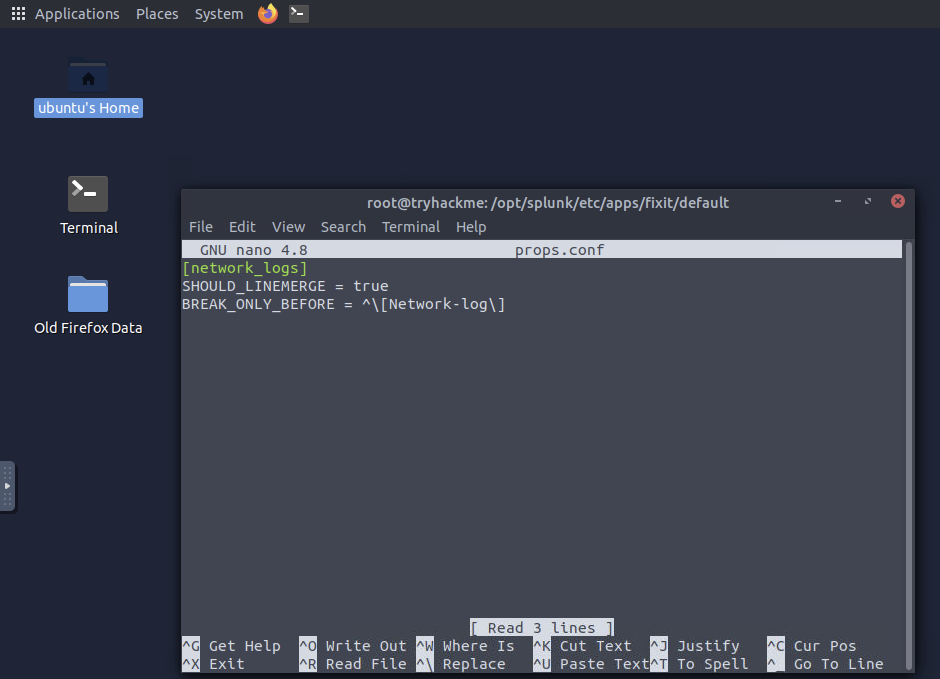
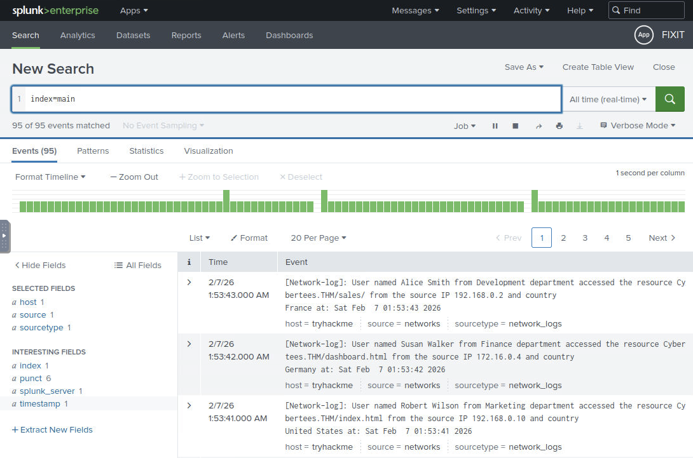
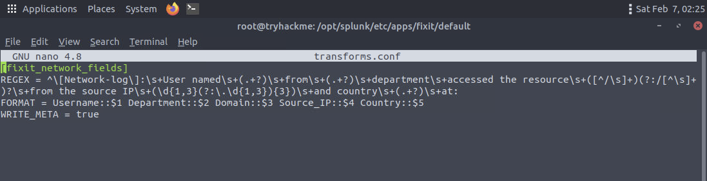
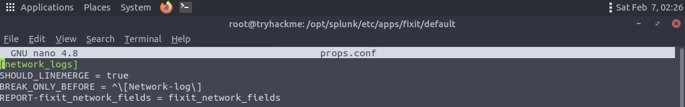
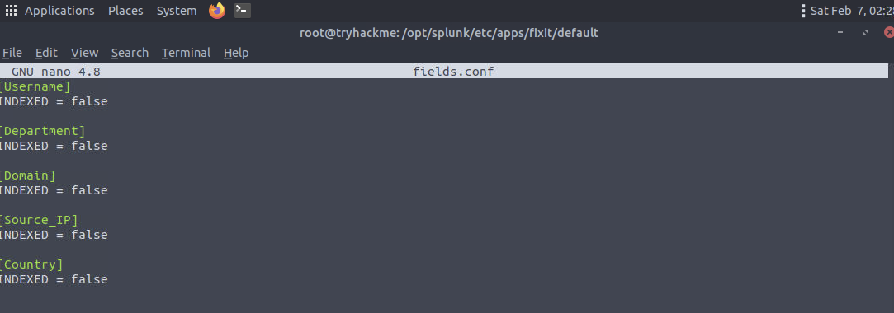
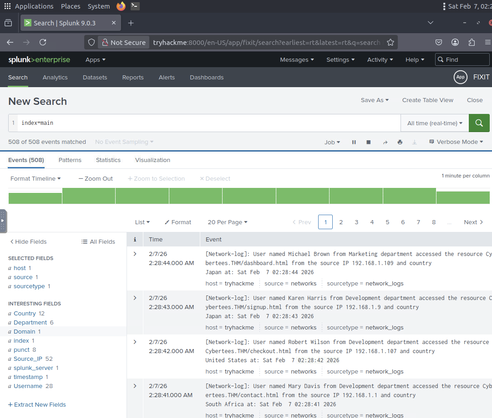
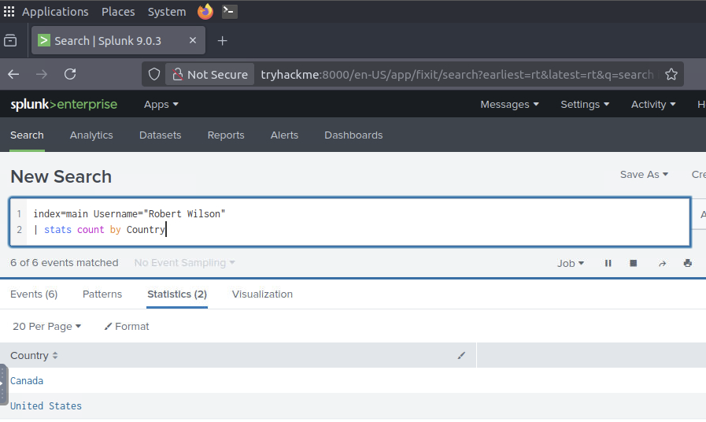
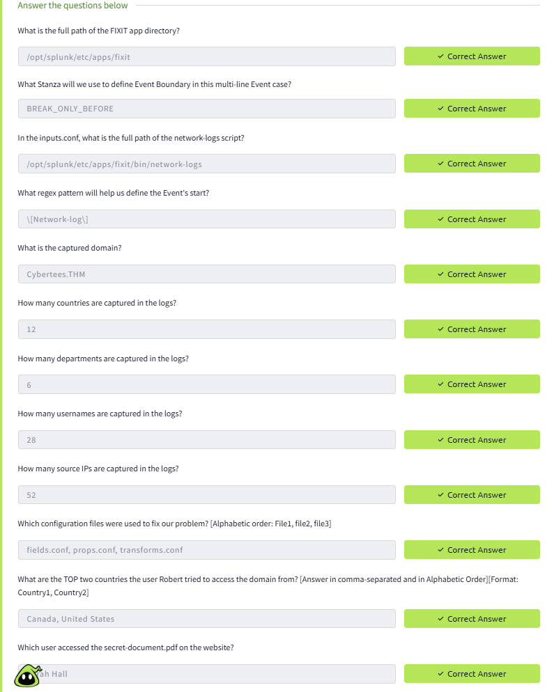

# Splunk Parsing & Log Analysis Lab (TryHackMe – FixIt)

This lab documents hands-on Splunk log parsing and analysis tasks completed as part of the  
**TryHackMe “FixIt”** room.

The purpose of this lab is to demonstrate practical understanding of **SIEM data ingestion and parsing**, including identifying incorrect event breaking, fixing parsing issues, and extracting meaningful fields required for security investigations.

---

## Lab Environment

**Platform**
- TryHackMe (FixIt room)

**Operating System**
- Linux-based virtual machine

**Tools**
- Splunk Enterprise

**Log Source**
- Network log dataset provided by the lab environment

---

## Objectives

This lab demonstrates the ability to:

1. Identify incorrect log ingestion behaviour in Splunk;
2. Fix event breaking issues at ingestion time;
3. Configure field extraction for security-relevant attributes;
4. Validate parsing improvements through analysis;
5. Perform log-based investigation and research.

---

## Lab Tasks and Implementation

### Step 1. Launch Splunk and Identify Incorrect Event Breaking
- Launched Splunk Enterprise on the Linux virtual machine;
- Reviewed ingested network logs in the Search interface;
- Identified that Splunk was breaking events incorrectly;
- Observed that single log entries were split into two events.

This issue prevented proper analysis and confirmed the need for ingestion-time parsing fixes.

---

### Step 2. Configure Event Breaking in `props.conf`
- Created a custom stanza in `props.conf` to control how Splunk breaks events;
- Ensured each log entry would be indexed as a separate event.

Correct event breaking is critical for accurate timestamping, searching, and investigation.

---

### Step 3. Configure Field Extraction Using `transforms.conf`
- Created a regular expression-based extraction in `transforms.conf` to extract key fields required for analysis, such as user identifiers, IP addresses, and domains;
- Prepared Splunk to extract structured fields from raw log events.

---

### Step 4. Update `props.conf` to Apply Transformations
- Updated the existing `props.conf` configuration;
- Linked the previously created transformation to the relevant sourcetype;
- Ensured field extraction would be applied during ingestion.

After this update, Splunk was able to correctly process and enrich incoming events.

---

### Step 5. Configure Field Indexing in `fields.conf`
- Defined extracted fields in `fields.conf`;
- Ensured fields were available for searching and reporting;
- Applied best practices to avoid unnecessary index-time overhead.

---

### Step 6. Validate Additional Field Extraction
- Verified that additional fields were correctly extracted;
- Ensured fields could be used for filtering and aggregation.

This validation confirmed that parsing issues had been fully resolved.

---

### Step 7. Research and Investigation
- Analysed parsed log data using extracted fields;
- Performed research based on log contents;
- Answered all investigation questions provided by the lab.

---

## Result

- Log events were correctly separated;
- Required fields were successfully extracted;
- Log data became suitable for investigation and analysis;
- All lab questions were answered based on parsed data.

---

## Key Skills Demonstrated

- Splunk log parsing and troubleshooting;
- Event breaking configuration;
- Field extraction and validation;
- SIEM data quality improvement;
- Log-based security investigation.

---

## Disclaimer

This lab was completed in a **non-production**, **simulated**, and **isolated** environment.
No real user data, credentials, or sensitive information were used.
