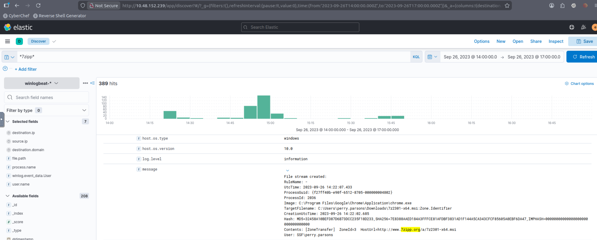
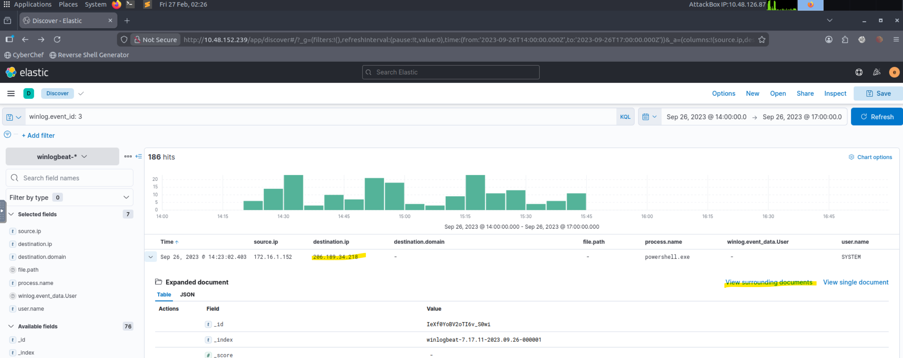

# Lab 04 — Intrusion Investigation in ELK (TryHackMe — Hunt Me II: Typo Squatter) 🧠🔎

**Platform:** TryHackMe  
**Room:** Hunt Me II: Typo Squatter (typosquatters)  
**Tooling:** Elasticsearch / Kibana (ELK)  
**Focus:** Intrusion investigation, execution chain tracking, persistence, credential access, ransomware impact assessment

---

## Objective

This lab demonstrates an end-to-end investigation workflow using **Kibana** to:

- identify initial infection via **typosquatting** (malicious download);
- follow the execution chain and secondary payload delivery;
- detect persistence via **service installation**;
- validate **C2 connectivity** and process context;
- identify credential access (LSASS dumping), lateral movement, and privilege escalation;
- confirm ransomware execution and quantify impact.

All analysis is performed in a controlled lab environment using simulated data.

---

## Investigation Approach

High-level workflow used throughout the lab:

1. **Triage & scoping** (identify victim host, suspicious download, initial IOC)
2. **Execution chain** (process → child process → downloads → scripts)
3. **Persistence & C2** (services, outbound connections)
4. **Credential access** (LSASS dump + parsing tools)
5. **Lateral movement / privilege escalation** (logons, password changes, new creds)
6. **Impact** (ransomware, encrypted files)

---

## Evidence (Screenshots)

All screenshots are stored under:

`Lab-04-Intrusion-investigation-in-ELK/Images/`

Use the placeholders below and rename files to match your actual screenshots.

---

### Q1 (What is the URL of the malicious software that was downloaded by the victim user?):

Used the typosquatting keyword from the scenario (`7zipp`) to pivot to web/network events related to the download. Then validated the URL by correlating the download event with surrounding records (same host, close timestamps).

---

### Q2 (What is the IP address of the domain hosting the malware?):

Starting from the malicious download event (Q1), inspected correlated fields (destination host/IP) and used “View surrounding documents” to confirm the same remote endpoint is consistently associated with the download.

---

### Q3 (What is the PID of the process that executed the malicious software?):
 
Pivoted from the download to the execution event by filtering on the same host and narrowing to process start telemetry (process creation). Extracted the PID from the execution event for the malware process.

**Evidence:** `Images/Q3_pid_execution.png`  

---

### Q4 (Following the execution chain of the malicious payload, another remote file was downloaded and executed. What is the full command line value of this suspicious activity?):

Followed the parent→child chain from Q3 and filtered for subsequent downloads/executions by the same process tree. Captured the suspicious **full command line** from the process creation event that performs remote retrieval + execution.

**Evidence:** `Images/Q4_command_line.png`  

---

### Q5 (The newly downloaded script also installed the legitimate version of the application. What is the full file path of the legitimate installer?):
 
From Q4, pivoted into the script activity and searched for the legitimate installer artifact (e.g., `7zlegit.exe`). Confirmed the exact on-disk path using the file creation / process execution context.

**Evidence:** `Images/Q5_legit_installer_path.png`  
**Answer:** `<paste full path here>`

---

### Q6 (What is the name of the service that was installed?):
  
Filtered Windows service installation telemetry using **Event ID 4697** (service-based persistence). Extracted the service name from the installation record.

**Evidence:** `Images/Q6_service_name_4697.png`  
**Answer:** `<paste service name here>`

---

### Q7 (The attacker was able to establish a C2 connection after starting the implanted service. What is the username of the account that executed the service?):

Correlated the installed service (Q6) with outbound network connections shortly after service start. Filtered for network connection telemetry to the malicious endpoint and extracted the executing user from the associated service/process context.

**Evidence:** `Images/Q7_service_user_c2.png`  
**Answer:** `<paste username here>`

---

### Q8 (After dumping LSASS data, the attacker attempted to parse the data to harvest the credentials. What is the name of the tool used by the attacker in this activity?):

Searched for LSASS-related activity (`lsass`) and then pivoted to subsequent parsing actions by reviewing process creation events around the dump timeframe. Identified the parsing tool by its process name/command line.

**Evidence:** `Images/Q8_lsass_parsing_tool.png`  
**Answer:** `<paste tool name here>`

---

### Q9 (What is the credential pair that the attacker leveraged after the credential dumping activity? (format: username:hash)):

Confirmed new authentication activity using **Event ID 4624** after the credential dump timeframe. Then searched for artifacts indicating credential material usage (hash references, password indicators, or tool output references) and extracted the `username:hash` pair.

**Evidence:** `Images/Q9_creds_username_hash.png`  
**Answer:** `<paste username:hash here>`

---

### Q10 (After gaining access to the new account, the attacker attempted to reset the credentials of another user. What is the new password set to this target account?):

Pivoted from the newly used account (Q9) to account-management events (password reset/change). Extracted the password value from the recorded activity (as captured in the lab dataset).

**Evidence:** `Images/Q10_password_reset.png`  
**Answer:** `<paste password here>`

---

### Q11 (What is the name of the workstation where the new account was used?):
 
Filtered successful logons (4624) for the new account and identified the associated workstation/hostname field. Confirmed by checking multiple logon events for consistency.

**Evidence:** `Images/Q11_workstation_used.png`  
**Answer:** `<paste workstation name here>`

---

### Q12 (After gaining access to the new workstation, a new set of credentials was discovered. What is the username, including its domain, and password of this new account?):
 
Scoped to the workstation from Q11 and filtered for process execution events indicative of credential discovery. Extracted the credential string (domain\username and password) from the relevant event/log content.

**Evidence:** `Images/Q12_new_credentials.png`  
**Answer:** `<paste domain\\username and password here>`

---

### Q13 (Aside from mimikatz, what is the name of the PowerShell script used to dump the hash of the domain admin?):

Filtered process creation for PowerShell execution (including script names in command line). Identified the script used for credential dumping (excluding mimikatz) based on the script filename referenced during execution.

**Evidence:** `Images/Q13_powershell_script.png`  

---

### Q14 (What is the AES256 hash of the domain admin based on the credential dumping output?):
  
Using the credential dumping context from Q13, located the output event containing the domain admin credential material and extracted the **AES256** hash value from the recorded output.

**Evidence:** `Images/Q14_aes256_hash.png`  

---

### Q15 (After gaining domain admin access, the attacker popped ransomware on workstations. How many files were encrypted on all workstations?):

Identified the ransomware executable name from the dataset (e.g., `bomb.exe`), then filtered for file-modification/creation telemetry associated with encryption activity and counted the total impacted files across all hosts.

**Evidence:** `Images/Q15_encrypted_files_count.png`  

---

## Skills Demonstrated

- Kibana-based investigation workflow (triage → pivoting → evidence collection)
- Typosquatting / initial access identification
- Process chain analysis and suspicious command line detection
- Persistence detection (service install)
- C2 validation via network telemetry correlation
- Credential access analysis (LSASS dump + parsing)
- Lateral movement / privilege escalation tracing
- Ransomware impact quantification

---

## Disclaimer

All work is performed in **non-production**, isolated environments using simulated datasets.
