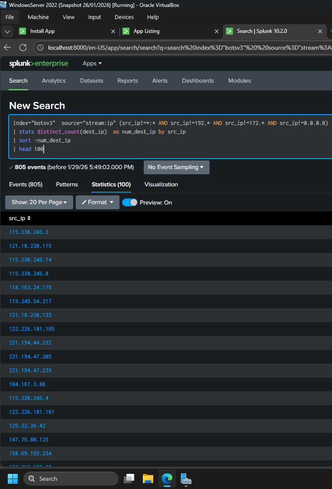
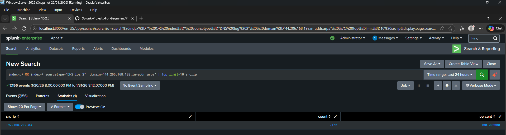

# Splunk Fundamentals Lab (SOC / SIEM Foundations)

This lab documents hands-on experience with **Splunk Enterprise** and **Splunk Universal Forwarder**, focusing on core SIEM concepts used in Security Operations Centers (SOC).

The lab demonstrates ingestion, parsing, searching, and analysis of security-relevant data using **Splunk Processing Language (SPL)**.

---

## Lab Environment

**Virtualisation**
- Oracle VirtualBox

**Operating Systems**
- Windows Server 2022

**SIEM Platform**
- Splunk Enterprise v10.2

---

## Objectives

The objectives of this lab were to:

- Deploy a functional Splunk environment
- Ingest and analyse security datasets
- Perform basic threat-hunting style analysis using SPL
- Identify suspicious indicators in DNS telemetry

---

## Lab Tasks and Implementation

### 1. Splunk Deployment

- Installed **Splunk Enterprise v10.2** on Windows Server 2022
- Installed and configured **Splunk Universal Forwarder**
- Verified successful data forwarding and indexing

---

### 2. Dataset Ingestion (botsv3)

- Uploaded the **botsv3 dataset** for analysis
- Confirmed correct sourcetypes and indexing
- Prepared data for further investigation

---

### 3. Initial Data Analysis Using SPL

Used core SPL commands including:

- `stats`
- `sort`
- `head`

Performed exploratory analysis to understand event volume and structure.

Saved search results as a **dashboard**.

---

### 4. DNS Log Analysis

#### 4.1 Field Extraction and Parsing

- Parsed DNS logs to extract:
  - IP addresses
  - Ports
  - Domain names
- Created searchable fields for analysis

---

#### 4.2 Frequency Analysis

- Used `top limit=20` to identify the most frequently queried domains
- Focused analysis on high-frequency and anomalous domains

---

#### 4.3 Suspicious Domain Identification

- Analysed domain frequency results
- Identified a **suspicious domain**
- Investigated the **associated IP address**

---

## 5. Alert Creation (Splunk Enterprise)

In this step I an alert **Splunk alert** to inform Splunk Administrator when specific user creates a process in Windows before the working day starts.

---

## Tools and Techniques Used

- Splunk Enterprise
- Splunk Universal Forwarder
- SPL (Search Processing Language)
- Dashboard creation
- DNS telemetry analysis
- Field extraction and parsing

---

## Key Skills Demonstrated

- SIEM deployment fundamentals
- Log ingestion and indexing
- SPL querying and aggregation
- Dashboard creation
- Threat-hunting style analysis
- DNS-based investigation techniques

---

## Learning Outcomes

- Built a functional Splunk SIEM lab
- Developed confidence using SPL for security analysis
- Strengthened understanding of SOC workflows
- Practiced identifying suspicious indicators in log data

---

## Disclaimer

This lab was performed in an **isolated, non-production environment**.  
No real users, credentials, or production systems were involved.
